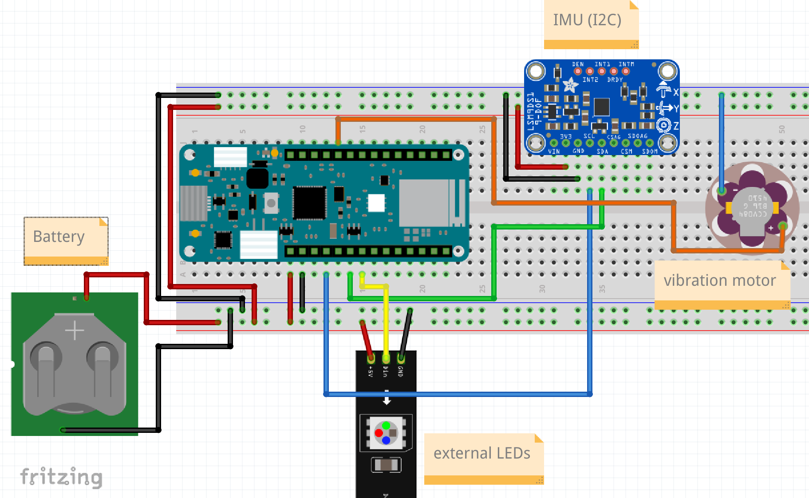
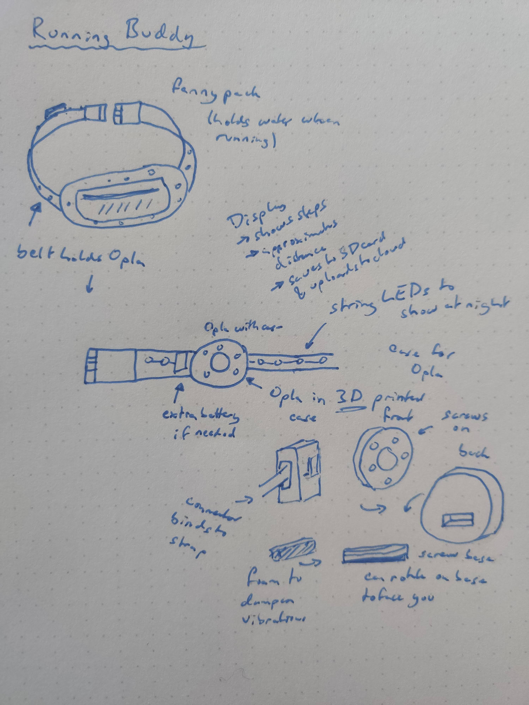

# Running Buddy

> Joshua Schmidt, jns223@cornell.edu

Running Buddy is a wearable based off of the Opla platform that is integrated into a runner's fanny pack. I'm using the one I run with for this prototype, so whatever it ends up being needs to be useful (and stand the test of time). The main features of this device will be step and distance tracking, as well as lights for night runs. The goal of the software implementation is for the device usage to be as seamless as possible.
When the user picks up the fanny pack and starts walking, it should start tracking steps immediately. Then when the user runs, the device should differentiate that action and save it as a new run. If runs happen in quick succession, the user is most likely on the same run and just took a break. Step counts can be calculated using the IMU, and distance can be extrapolated from the steps. The light sensor will be used to see when it's dark and trigger a lighting effect.
The wearable will also have a screen and touch button controls that act as an interface for controlling the lights or starting a new run manually. The Opla will be housed in a 3D printed case that attaches to the fanny pack with a hook and screw mechanism (see the diagram). The goal is to be able to remove the opla with the pack still on to see the screen and interact with the controls more easily. Then when you are done you can clip it back on.
When running you're jostling the device around a lot, so it is important to dampen the device with foam. If there's time, I will also add a haptic motor for feedback, so when the user hits certain milestones like 5,000 steps or 3 miles ran, it'll trigger an alert.

video: [https://youtu.be/YYZUek4NLus](https://youtu.be/YYZUek4NLus)

\newpage

## Schematic:

\newpage

## Diagram:

{ width=300px }
